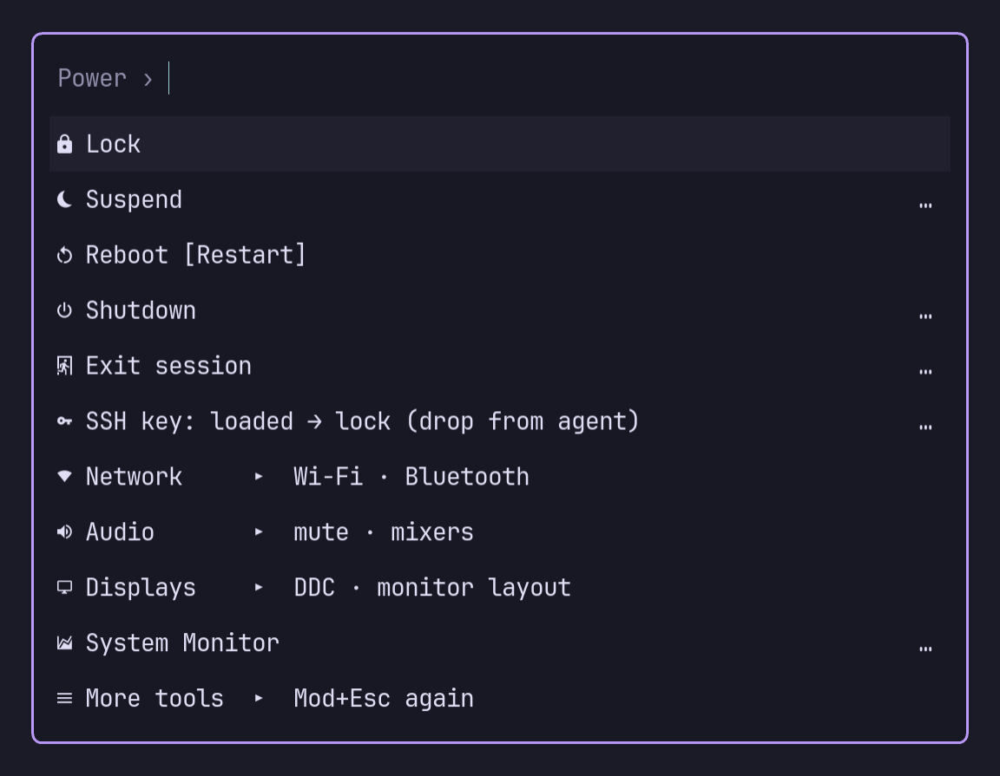
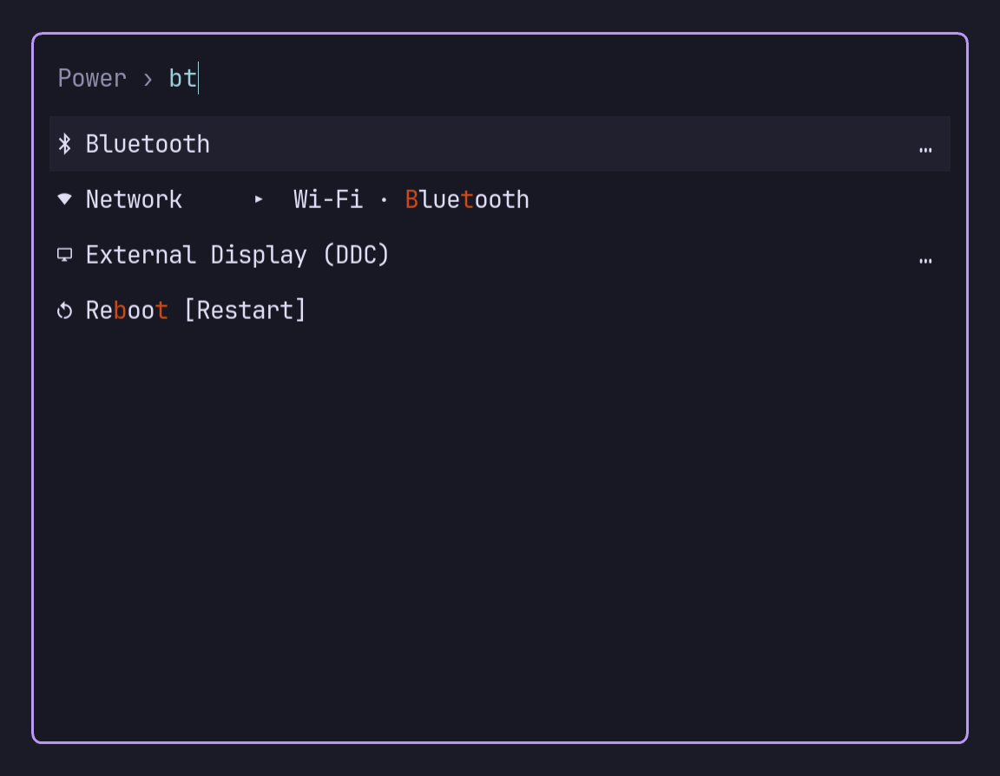
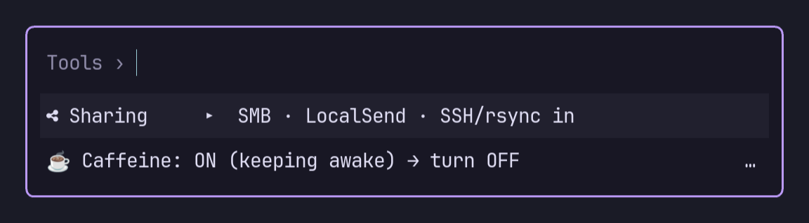
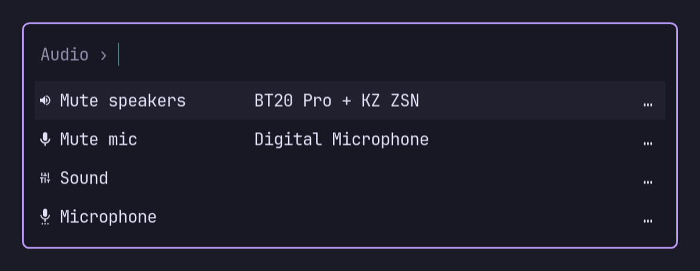
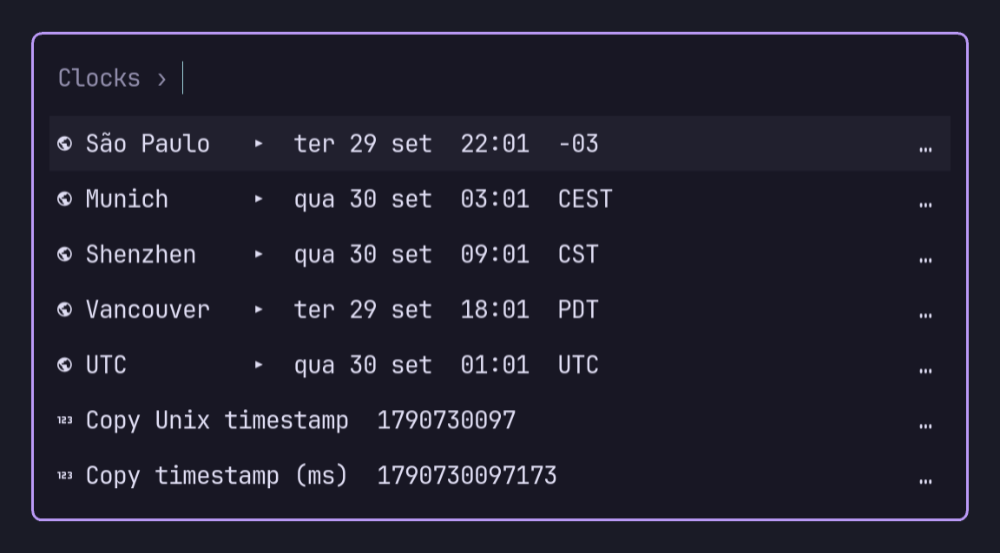
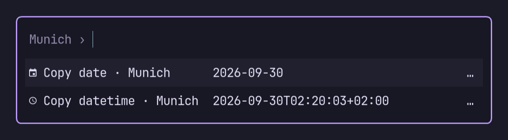

# rodii-power-menu

A which-key style power / system menu for [niri](https://github.com/YaLTeR/niri),
shown with [fuzzel](https://codeberg.org/dnkl/fuzzel) and described by a KDL file.

- **Pages.** Bind it to a key (Mod+Escape). Pressing the key again while the menu
  is open flips to the next page, which keeps the first page short.
- **Groups.** `▸` rows open submenus. Esc goes back one level, and closes the menu
  from a page.
- **Flat search.** Every page also gives fuzzel all the other entries, below the
  visible rows, so typing finds anything from anywhere.
- **Live items.** A `state` shell command picks a `when` variant, for example
  "Mute" versus "Unmute" or "SSH key: loaded → lock".
- **Fast.** About 12 ms from launch until fuzzel starts on the author's machine
  (the fish script it replaced took about 111 ms). See [Speed](#speed).

## Screenshots

| Mod+Escape: first page | Typing searches every page |
| --- | --- |
|  |  |
| **Mod+Escape again: next page** | **A group, with live device names** |
|  |  |
| **Groups can show live values** | **Each row shows what it will copy** |
|  |  |

These screenshots show the author's [menu](https://github.com/rdlu/dotfiles/blob/main/niri/dot-config/rodii-power-menu/menu.kdl)
with their fuzzel theme. They were taken in a headless sway session with `grim`.

## Usage

```
rodii-power-menu              open the menu
rodii-power-menu validate     check the config: line-numbered problems, exit 1 if any
rodii-power-menu print        every page as fuzzel gets it, with live states + timings
```

The config is read from `$RODII_POWER_MENU_CONFIG`, or else
`$XDG_CONFIG_HOME/rodii-power-menu/menu.kdl`. `validate` and `print` also accept
a file path.

niri:

```kdl
Mod+Escape hotkey-overlay-title="Power menu (press again: next page)" { spawn "~/.local/bin/rodii-power-menu"; }
```

## Config

```kdl
state-timeout-ms 40                                  // budget for state checks
fuzzel "--font=JetBrainsMono Nerd Font Mono:size=14" // extra fuzzel args

page "Power" {
    item "Lock" icon="\u{f023}" run="loginctl lock-session"
    item "Bluetooth" id="bluetooth" icon="\u{f294}" run="ghostty -e bluetui" keywords="bt"

    group "Audio" icon="\u{f028}" hint="mute · mixers" {
        item "Mute speakers" run="swayosd-client --output-volume mute-toggle" {
            state "pactl get-sink-mute @DEFAULT_SINK@"
            when "Mute: yes" label="Unmute speakers"
            detail #"wpctl inspect @DEFAULT_AUDIO_SINK@ | awk -F'"' '/node.nick/ {print $2}'"#
        }
    }

    link "More tools" page="Tools" hint="Mod+Esc again"
}

page "Tools" {
    group "Network" {
        use "bluetooth"
    }
}
```

| Node | Meaning |
| --- | --- |
| `item "Label" icon= run= keywords=` | Runs a command with `sh -c`, with `~/.local/bin` on `PATH`. |
| `group "Label" icon= hint= detail= fresh= { … }` | A `▸` row that opens a submenu. Groups can be nested. A `detail` replaces the hint (e.g. a clock). |
| `link "Label" page="Name" hint= detail= fresh=` | A `▸` row that jumps to another page. |
| `use "id"` | The item or group that has `id="id"`. It can be defined anywhere, in any order. |
| `define { … }` | Items that appear only through `use`. |

Inside an `item`:

- **`state "cmd"`:** the first line of its output picks a `when "<output>"`
  variant, and `when "*"` is the fallback. A variant can override `icon`,
  `label`, `run`, `keywords` and `hint`.
- **`detail "cmd"`:** the first line of its output is shown as a right-hand column.
  A detail normally shows its cached value at once and refreshes in the
  background. Add `fresh=#true` to wait for it like a `state`: use this for fast
  values that change often, such as the Wi-Fi network
  (`detail "iw dev | sed -n 's/^[[:space:]]*ssid //p'" fresh=#true`).
  Groups and links take `detail` and `fresh` as properties, and their detail
  replaces the hint. Details on one screen are aligned in a single column.
- **Long values as child nodes:** `run`, `icon` and `keywords` can also be written
  as child nodes.

Tips:

- **Icons:** write nerd-font icons as escapes (`"\u{f023}"`). The private-use
  glyphs are invisible in most tools and get lost in edits.
- **Quotes in commands:** put commands that contain `"` in raw strings: `#"…"#`.
- **Switching things off:** put `/-` before any node to disable it.
- **Keywords and the `…`:** keywords are appended to the row far past the right
  edge of the window, so fuzzel matches and ranks them without showing them.
  fuzzel draws a `…` on rows that have keywords. (Keeping them in a separate,
  hidden `--match-nth` column would turn off fuzzel's ranking, and then `bt`
  put Reboot above Bluetooth.) If two items share a keyword, the shorter row
  wins, so keep each keyword on the item it should find.
- **Labels and keywords beat hints and details:** a whole-word match in a label
  or keyword ranks above the same match in a hint or `detail`. So `bt` finds
  Bluetooth before a headset whose name starts with "BT". (The side text is
  joined with no-break spaces, which fuzzel doesn't treat as word starts.)

## Speed

The menu runs the same steps every time it opens:

1. **Config:** the parsed menu is compiled into `$XDG_RUNTIME_DIR/rodii-power-menu/menu.bin`
   (postcard). It's reused while the KDL file and the binary are unchanged
   (size and mtime), so a normal open skips the KDL parser: about 0.05 ms instead
   of about 2 ms.
2. **State checks:** all `state` and `detail` commands start in parallel. The menu
   waits for `state` commands up to `state-timeout-ms`. Any that miss the budget
   show their last known value, cached in `state-cache`.
3. **Details:** `detail` commands never block once they have a cached value
   (unless marked `fresh=#true`). They only refresh it for the next open.
4. **No shell when not needed:** commands without shell syntax run directly,
   without `sh`, which saves about 1 ms each.

What's left is mostly the state commands themselves. `pactl` answers in about
5 ms, and `wpctl` in about 8–10 ms.

## Install

You need **fuzzel** 1.15 or newer (the menu relies on `--index`, `--with-nth`
and `--match-nth`) and a compositor that can bind a key to a command. The
examples use niri.

**Prebuilt binary.** Each
[release](https://github.com/rdlu/rodii-power-menu/releases) includes a static
x86_64 Linux binary. It doesn't depend on your system's glibc, so it runs on any
distro:

```sh
v=v0.1.3
curl -LO https://github.com/rdlu/rodii-power-menu/releases/download/$v/rodii-power-menu-$v-x86_64-linux.tar.gz
tar -xzf rodii-power-menu-$v-x86_64-linux.tar.gz
install -Dm755 rodii-power-menu-$v-x86_64-linux/rodii-power-menu ~/.local/bin/rodii-power-menu
```

**From source.** This needs a Rust toolchain:

```sh
git clone https://github.com/rdlu/rodii-power-menu
cd rodii-power-menu
mise run install        # build → ~/.local/bin/rodii-power-menu, then validate
# without mise:
cargo build --release && install -Dm755 target/release/rodii-power-menu ~/.local/bin/
```

From a checkout, mise tasks manage the local install:

| Task | Does |
| --- | --- |
| `mise run install` | Builds from source into `~/.local/bin`, then validates the config. |
| `mise run install-release [version]` | Installs the latest (or a given) prebuilt release. No Rust needed; the checksum is verified. |
| `mise run status` | Shows the installed version, whether it's a local or release build, whether it matches this checkout, the latest release, and a config check. |
| `mise run uninstall` | Removes the binary and its runtime caches. Your `menu.kdl` is kept. |

Then:

1. Write `~/.config/rodii-power-menu/menu.kdl`. Start from the [Config](#config)
   example, or from the author's full menu in
   [rdlu/dotfiles](https://github.com/rdlu/dotfiles/blob/main/niri/dot-config/rodii-power-menu/menu.kdl).
   Its commands call the author's own scripts, so adapt them to yours.
2. Check it with `rodii-power-menu validate`.
3. Bind a key to `~/.local/bin/rodii-power-menu`.

## Releasing

```sh
mise run release 0.1.2 --dry-run   # check, bump and package, show the notes, then restore
mise run release 0.1.2             # the real thing
mise run release 0.1.2 --notes notes.md
```

`release` first checks that the version is newer, the tag is free, `main` is
clean and in sync with origin, the musl target is installed and clippy passes.
Then it:

1. bumps `Cargo.toml`, `Cargo.lock` and the README install line;
2. builds the static tarball and checks that it's static and runs;
3. commits and pushes `vX.Y.Z`;
4. publishes the GitHub release;
5. downloads the release back and verifies the checksum.

If you don't pass `--notes`, the release notes are the commit subjects since the
last tag, plus the install snippet. The one-time setup is
`rustup target add x86_64-unknown-linux-musl`.

## License

MIT
